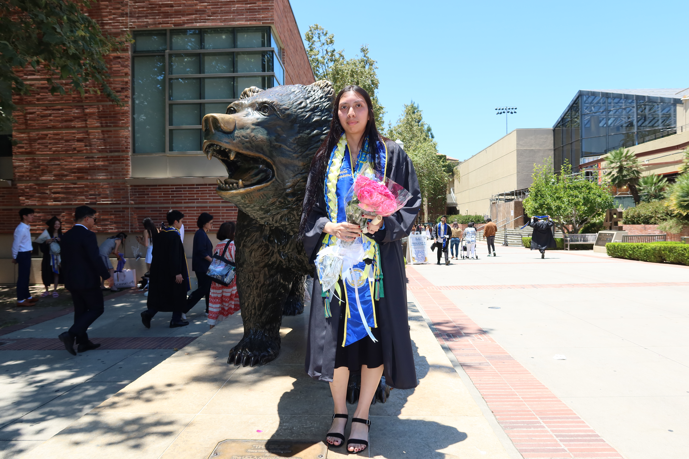

::::: profile-layout
::: profile-sidebar
{.profile-image}

### Fabiola Campuzano

Statistics & Data Science + Cognitive Science

📍 Los Angeles, CA

[LinkedIn](www.linkedin.com/in/fabiolacampuzano)

[GitHub](https://github.com/fabiolacampuzano)
:::

::: profile-main
# Fabiola Campuzano

Statistics & Data Science and Cognitive Science graduate interested in behavioral research, public health, and quantitative approaches to understanding human behavior.

## About Me

I am interested in using data to study questions related to cognition, health, and human behavior.

My experience includes behavioral research, experimental design, survey development, statistical analysis, and human-subject research.

I am particularly interested in opportunities at the intersection of **public health, epidemiology, behavioral science, and data analysis**.

## Current Work

I currently work as a research assistant in the Rissman Memory Lab at UCLA, supporting a cognitive neuroscience study examining memory processes in naturalistic contexts using **mobile EEG**.

My work includes developing Qualtrics surveys, preparing experimental protocols, selecting stimuli, implementing cognitive and creativity measures, and preparing for EEG-based participant sessions.
:::
:::::
