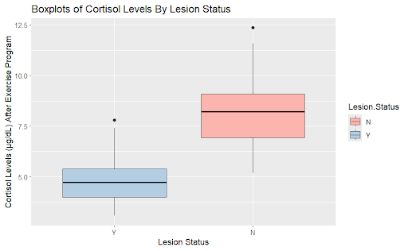
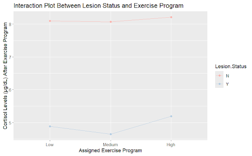
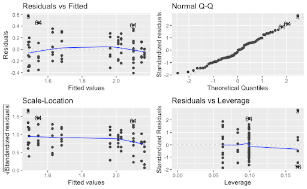

## Overview

This project examined the effects of **exercise intensity and hypothalamic lesion status on cortisol levels**, a biomarker of physiological stress.

The hypothalamus plays an important role in regulating the body's stress response through the hypothalamic-pituitary-adrenal (HPA) axis. Damage to the hypothalamus may therefore interfere with normal cortisol production and stress regulation.

The study used a randomized complete block design to investigate whether cortisol responses differed between individuals with and without hypothalamic lesions and whether those differences depended on exercise intensity.  

## Research Question

**How do hypothalamic lesions and varying intensities of exercise affect cortisol responses?**

The study also examined whether there was an interaction between lesion status and exercise intensity and whether sex influenced cortisol levels as a blocking factor. 

## Methods

The study used a **Randomized Complete Block Design with two treatment factors**.

### Treatment Factors

**Hypothalamic lesion status**

- Hypothalamic lesion
- No lesion

**Exercise intensity**

- Low
- Medium
- High

### Blocking Factor

**Sex**

- Male
- Female

The study included **72 participants**, with 36 males and 36 females. Participants were randomly assigned in R to one of six combinations of lesion status and exercise intensity.  

Baseline cortisol levels were measured before exercise. Participants then completed their assigned exercise program, followed by a second cortisol measurement immediately after exercise.  

## Sample Size & Power

An a priori power analysis was conducted using **G*Power**.

The analysis assumed:

- Effect size = **0.40**
- Significance level = **0.05**
- Statistical power = **0.80**

The estimated minimum sample size was 64 participants. The planned sample was increased to **72 participants** to maintain a balanced experimental design.  

## Statistical Analysis

The data were analyzed in **R** using a linear model and Analysis of Variance (ANOVA).

The model tested:

- The main effect of hypothalamic lesion status
- The main effect of exercise intensity
- The interaction between lesion status and exercise intensity
- The effect of sex as a blocking factor

Tukey HSD analysis was used for post-hoc comparisons, and residual diagnostics were examined to evaluate model assumptions.  

## Results

### Cortisol by Lesion Status

{width=70%}

Participants without hypothalamic lesions showed higher post-exercise cortisol levels than participants with lesions.

ANOVA showed a **statistically significant main effect of lesion status**, with *p* < .001.

### Exercise Intensity

Cortisol levels did not show a clear difference across low-, medium-, and high-intensity exercise conditions.

The main effect of exercise intensity was **not statistically significant**, *p* = .563.

### Lesion Status × Exercise Intensity

{width=70%}

The interaction plot showed similar patterns across exercise intensities for participants with and without hypothalamic lesions.

The interaction between lesion status and exercise intensity was **not statistically significant**, *p* = .947. 

### Effect of Sex

Sex was a statistically significant blocking factor, *p* = .017.

Tukey HSD analysis indicated that females had higher cortisol levels than males.  

## Model Diagnostics

{width=75%}

The residual plots showed approximately random scatter around zero and relatively constant variance. The Normal Q-Q plot also showed no major departures from normality, supporting the assumptions used for the linear model and ANOVA.  

## Key Findings

- **Hypothalamic lesion status had a statistically significant effect on post-exercise cortisol levels.**
- Participants with hypothalamic lesions showed lower cortisol levels after exercise than participants without lesions.
- **Exercise intensity did not have a statistically significant main effect.**
- There was **no statistically significant interaction** between lesion status and exercise intensity.
- **Sex was a statistically significant blocking factor** and was associated with differences in cortisol levels.  

## Limitations

The lack of a significant exercise-intensity effect may indicate that the exercise conditions did not produce sufficiently distinct physiological stress responses.

The study design also controlled several participant characteristics to increase homogeneity, which may limit how broadly the results can be generalized.

Future research could use more objective measures of exercise load or individual fitness level and examine whether hypothalamic lesions affect cortisol responses to other forms of stress, including social, emotional, or mental stressors.  

## Skills Demonstrated

`Experimental Design` `R` `ANOVA` `Randomized Complete Block Design` `Power Analysis` `Interaction Effects` `Tukey HSD` `Model Diagnostics`