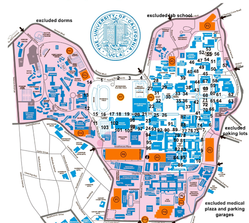
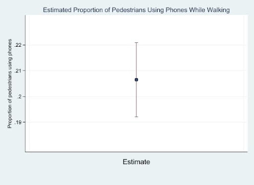

## Overview

This sampling study examined phone use among pedestrians walking outdoors on the UCLA main campus. The goal was to estimate the proportion of pedestrians actively looking at their phones while walking during a period of high pedestrian traffic.

Because obtaining a complete list of pedestrians on campus at a given time is impossible, I used a probability-based cluster sampling design to estimate this behavior from a sample of UCLA campus walkways.

## Research Question

**What proportion of pedestrians walking outdoors on the UCLA main campus between 10:30 AM and 1:30 PM on a Thursday in March are actively looking at their phones while walking?**

This behavior is relevant to pedestrian attention and safety because UCLA has dense pedestrian traffic and multiple modes of transportation, including scooters, skateboards, bikes, pedestrians, and cars.

## Sampling Design

The target population consisted of pedestrians walking outdoors on the UCLA main academic campus between 10:30 AM and 1:30 PM.

I identified **103 eligible walkway segments** across the UCLA main campus and used these locations as clusters in the sampling frame.

From the 103 clusters, I randomly selected **20 walkway locations without replacement**, giving each cluster an equal probability of selection.

## Data Collection

At each randomly selected walkway, I established a fixed imaginary line and observed all pedestrians who crossed the line during a **4-minute observation period**.

Each pedestrian was classified according to whether they were actively looking at their phone at the moment they crossed the line.

The final sample contained:

- **20 randomly selected walkway clusters**
- **983 pedestrian observations**
- **103 total clusters in the sampling frame**

Observations were collected directly rather than through self-reported surveys, reducing the potential for response bias.

## Statistical Analysis

The observations were analyzed in **Stata** using a one-stage cluster sampling estimator.

Walkway locations were specified as the primary sampling units. The analysis incorporated:

- A sampling weight of **103/20**
- A finite population correction based on the **103 walkway clusters**
- Survey-adjusted standard errors
- A 95% confidence interval

The outcome was coded as 1 when a pedestrian was actively looking at their phone and 0 otherwise. The survey-adjusted mean therefore represented the estimated population proportion.

## Results

The estimated proportion of pedestrians actively looking at their phones while walking was:

### **20.65%**

The estimated standard error was **0.00686**, with a **95% confidence interval of 19.22% to 22.09%**.

Overall, the results suggest that approximately **one in five pedestrians** on the UCLA main campus during this period were actively looking at their phones while walking.

## Sources of Bias & Limitations

Several factors may have affected the accuracy and generalizability of the estimate.

Data collection occurred on the same day and around the same time as a TA strike outside Royce Hall, which may have altered normal pedestrian traffic patterns.

Several elementary and middle school tour groups were also present. Younger visitors may have been less likely to use smartphones while walking, potentially lowering the estimated proportion. Dense tour groups also made it more difficult to record every pedestrian crossing the observation line.

Pedestrian behavior may also vary within the 10:30 AM–1:30 PM observation window, particularly during class transitions when pedestrian traffic increases.

Finally, observing each cluster for only four minutes may not fully capture variation in behavior throughout the broader time period.

## Strengths

- Developed a probability-based sampling frame of **103 campus walkways**
- Randomly sampled **20 clusters** without replacement
- Directly observed **983 pedestrians**
- Used a clearly defined behavioral outcome rather than self-reported phone use
- Accounted for the cluster sampling design, sampling weights, and finite population correction during estimation

## Key Takeaways

- Approximately **20.65%** of pedestrians were actively looking at their phones while walking.
- The 95% confidence interval placed the estimated population proportion between approximately **19% and 22%**.
- Cluster random sampling made it possible to estimate campus-wide pedestrian behavior without conducting a census.
- Direct behavioral observation reduced response bias, while probability sampling improved the representativeness of the estimate.
- The project demonstrated how sampling design, field data collection, and survey-adjusted statistical analysis can be combined to study real-world behavior.

## Skills Demonstrated

`Probability Sampling` `Cluster Sampling` `Survey Analysis` `Stata` `Field Data Collection` `Statistical Inference` `Study Design` `Data Visualization`