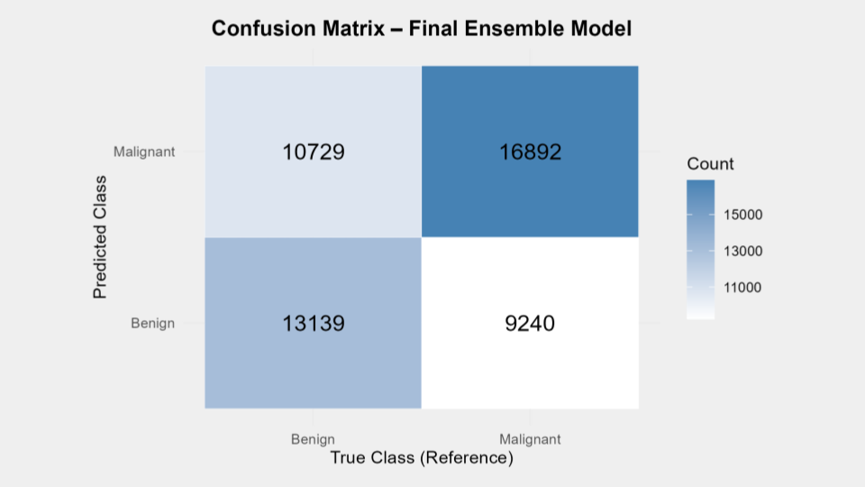

## Overview

This project used statistical learning methods to predict whether a skin cancer diagnosis was **benign or malignant** using a synthetic dataset of clinical, demographic, environmental, and behavioral predictors.

The training dataset contained **50,000 observations and 50 predictors**, while the test dataset contained **20,000 observations**. Predictors included UV exposure, mole characteristics, family history, health measures, and lifestyle behaviors.

The analysis involved data cleaning, missing-value imputation, feature engineering, model development, and evaluation through a Kaggle classification competition.

## Research Goal

**Can clinical, demographic, and behavioral factors be used to predict skin cancer status using statistical learning methods?**

The goal was to develop a classification model that could distinguish between benign and malignant cases while maintaining balanced performance across both classes.

## Data Preparation

Exploratory analysis showed that approximately **8% of predictor values were missing**.

Several approaches to missing-data imputation were explored, including MICE and missRanger. More sophisticated methods did not improve classification performance for this dataset, so the final modeling pipeline used **mean, median, and mode imputation**.

Categorical predictors were also one-hot encoded for model development.

## Feature Engineering

After imputation, interaction terms were created to capture relationships in which multiple risk factors could amplify one another.

Examples included:

- UV exposure × health
- Age × UV exposure
- Mole characteristic interactions

Across the models tested, several of the strongest predictors were related to:

- **Mole characteristics:** color score and diameter risk
- **UV exposure and behavior:** UV risk score, tanning bed use, and outdoor activity
- **Biological and health factors:** overall health score, family history, and age

## Modeling Approach

### Logistic Regression

Logistic regression was used as the initial baseline model because of its simplicity and interpretability.

After one-hot encoding, the model contained more than **200 encoded predictors**. Although logistic regression provided a useful benchmark, it was limited in its ability to capture the relationships represented by the engineered features.

### Partial Least Squares

Partial Least Squares (PLS) was used as a supervised dimension-reduction method to manage the large number of correlated predictors while identifying components associated with the target variable.

### Elastic Net

Elastic Net combined **L1 and L2 regularization**, allowing the model to perform feature selection while shrinking coefficients for correlated predictors.

This provided greater stability when working with the large and highly correlated predictor set.

## Final Ensemble Model

Rather than relying on a single classifier, the final model combined **Partial Least Squares and Elastic Net** using a weighted voting system.

The probability predictions produced by the two models were combined, with the weights optimized empirically through iterative evaluation on the Kaggle competition platform.

This approach combined PLS's ability to manage correlated predictors with Elastic Net's regularization and feature-selection capabilities.

## Model Performance

The final ensemble achieved:

- **Kaggle score:** 0.60640
- **Test accuracy:** 60.06%
- **Sensitivity:** 55.05%
- **Specificity:** 64.64%

{width="70%"}

The final model correctly classified **16,892 malignant cases** and **13,139 benign cases**. Sensitivity and specificity were relatively balanced, indicating that the model did not overwhelmingly favor classification of one outcome over the other.

## Limitations

The dataset was synthetic, so the extent to which relationships between the predictors and skin cancer diagnosis reflect real patient populations is unknown.

Many predictors were noisy and showed weak relationships with cancer status, limiting overall predictive performance. The use of simple mean, median, and mode imputation may also have reduced natural variation or overlooked relationships in the missing data.

Most importantly, the dataset contained **no skin lesion images**, despite visual information being a major component of clinical skin cancer diagnosis. The model therefore represents a complementary risk-assessment approach based on structured clinical and behavioral information rather than a replacement for traditional diagnosis.

## Key Takeaways

- Developed a classification pipeline using **70,000 total training and test observations** and **50 original predictors**.
- Compared logistic regression, Partial Least Squares, and Elastic Net approaches.
- Engineered interaction terms to capture relationships among UV exposure, biological health, age, and other risk factors.
- Combined PLS and Elastic Net into a weighted ensemble model.
- Achieved a **0.60640 Kaggle score**.
- Evaluated model performance using accuracy, sensitivity, specificity, and a confusion matrix.

## Skills Demonstrated

`Statistical Learning` `R` `Classification` `Elastic Net` `Partial Least Squares` `Logistic Regression` `Feature Engineering` `Missing Data` `Model Evaluation`
