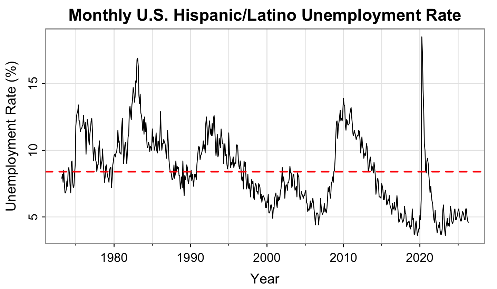
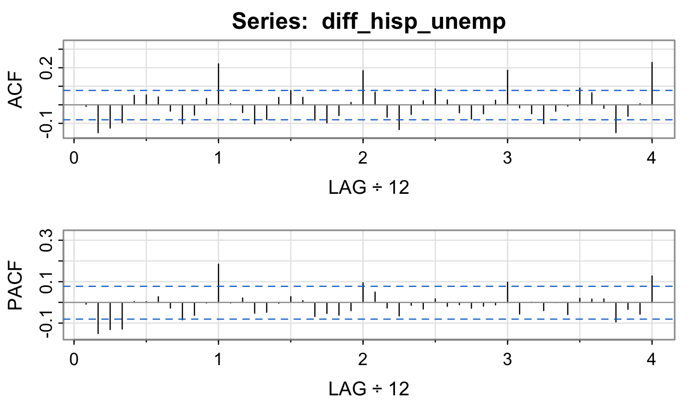
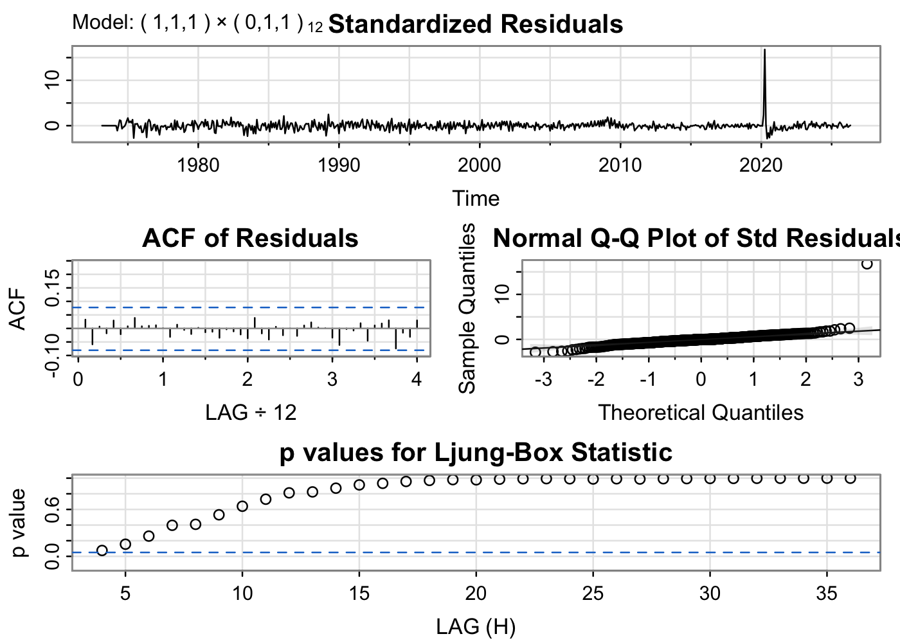
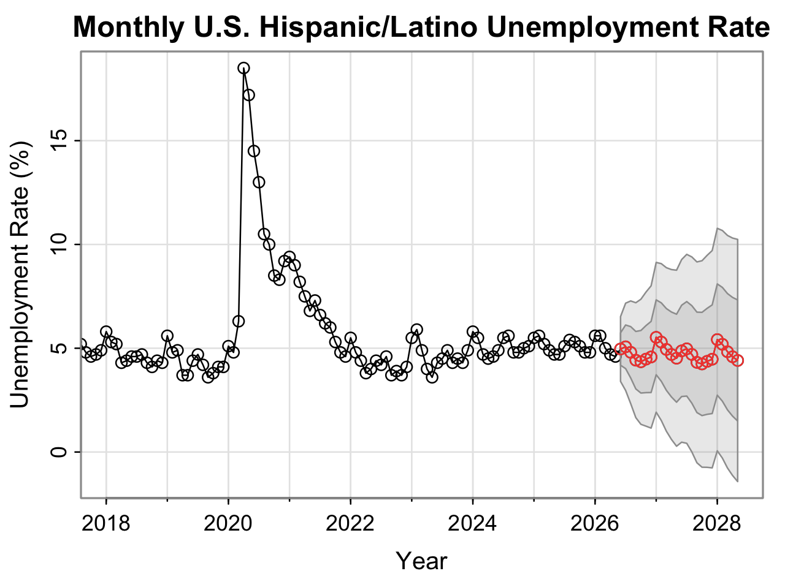

## Overview

Analyzed monthly U.S. Hispanic and Latino unemployment rates from 1973–2026 using differencing, ACF/PACF diagnostics, and SARIMA modeling to identify temporal patterns, evaluate economic shocks, and generate forecasts.

## Research Question

**How can seasonal time series models be used to describe and forecast the monthly U.S. unemployment rate for the Hispanic and Latino workforce?**

To answer this question, the original series was examined, differencing was applied to address nonstationarity, candidate SARIMA models were compared, residual diagnostics were evaluated, and a **24-month forecast** was produced.

## Data

The data were sourced from the Federal Reserve Bank of St. Louis and contain the monthly U.S. unemployment rate for people of Hispanic or Latino origin from **March 1973 through May 2026**. The unemployment rate is defined as the number of unemployed people as a percentage of the Hispanic and Latino labor force.

The original dataset contained one missing value for October 2025. To preserve the regular monthly interval and retain the recent data for forecasting, this value was imputed using the mean of the September and November observations and rounded to **5.1%**. 

## Exploratory Data Analysis

The Hispanic and Latino unemployment rate does not show a long-term increasing or decreasing trend, but instead fluctuates substantially with periods of sharp increases and gradual decreases. The series also shows longer-run cyclical behavior related to recessions and economic shocks.

The largest outlier occurs around **2020**, when unemployment reaches its highest value in the series during the COVID-19 pandemic. The ACF of the original series slowly decays and remains positive across many lags, showing strong persistence over time. Together, these patterns suggest that the series is not stationary. 

{width=90%}

## Differencing and Seasonality

After first differencing, the transformed series fluctuates around a mean near zero, indicating that differencing removed much of the persistence in the original series. However, noticeable peaks remain around lags **12, 24, 36, and 48**, suggesting possible annual seasonality. 

{width=90%}

After applying both first and seasonal differencing, most autocorrelations are near zero and within the confidence bounds. The remaining seasonal pattern suggested that a seasonal MA(1) term could be useful.

## Candidate Models

Three candidate models were compared:

- SARIMA(1,1,1)(0,1,1)[12]
- SARIMA(2,1,1)(0,1,1)[12]
- SARIMA(1,1,2)(0,1,1)[12]

The residual diagnostics for all three models were very similar. Standardized residuals fluctuated around zero with no obvious trend or seasonal pattern, most residual autocorrelations fell within the confidence bounds, and Ljung–Box p-values were mostly above 0.05. However, all models retained a large residual spike around 2020 corresponding to the COVID-19 pandemic.

## Selected Model

Since the residual diagnostics were similar across candidate models, the final model was selected using AIC, AICc, and BIC.

SARIMA(1,1,2)(0,1,1)[12] had the lowest AIC and AICc values, while SARIMA(1,1,1)(0,1,1)[12] had the lowest BIC. Because the improvement in AIC and AICc for the more complex models was minimal, **SARIMA(1,1,1)(0,1,1)[12]** was selected as the final model because it provided a balance between goodness of fit and simplicity. 

All estimated coefficient terms in the selected model were statistically significant. 

## Forecasting

The selected SARIMA(1,1,1)(0,1,1)[12] model was used to produce a **24-month forecast** beginning after May 2026.

The forecast suggests that the Hispanic and Latino unemployment rate will remain relatively stable over the next two years, ranging between approximately **4.2% and 5.5%**. The forecast shows month-to-month variation but no major upward or downward trend, while prediction intervals widen over the forecast horizon as uncertainty increases. 

{width=90%}

## Limitations

A major limitation of the analysis is the presence of unexpected economic shocks, particularly the COVID-19 unemployment spike in 2020. The model also relies only on historical unemployment rates and does not incorporate external predictors such as inflation, policy changes, recession indicators, or structural labor-market factors. 

## Key Takeaways

- First and seasonal differencing were used to address nonstationarity and remaining annual seasonality.
- Candidate SARIMA models were compared using residual diagnostics and information criteria.
- SARIMA(1,1,1)(0,1,1)[12] was selected as the final model because it balanced goodness of fit and simplicity.
- The final model forecast Hispanic and Latino unemployment to remain around **4.2%–5.5%** over the following 24 months.
- The analysis shows how time series models can identify trends, seasonality, and dependence in unemployment data while also illustrating the limits of forecasting unexpected disruptions. 

## Skills Demonstrated

`R` `Time Series Analysis` `SARIMA` `Forecasting` `ACF/PACF` `Model Diagnostics` `Data Visualization`