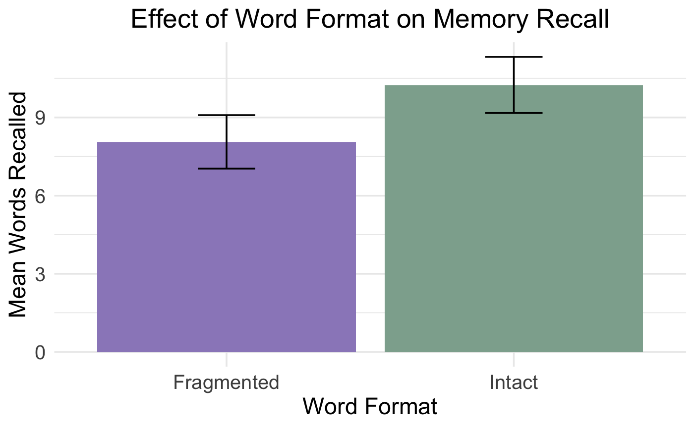
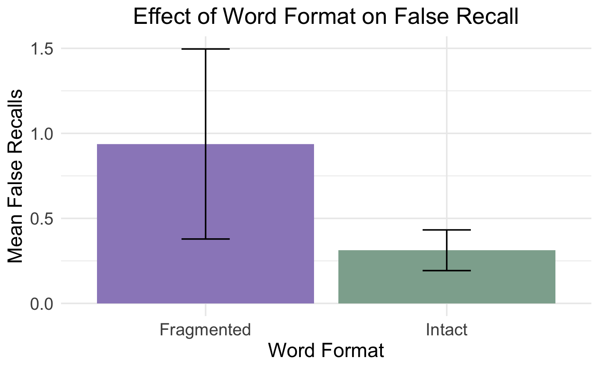
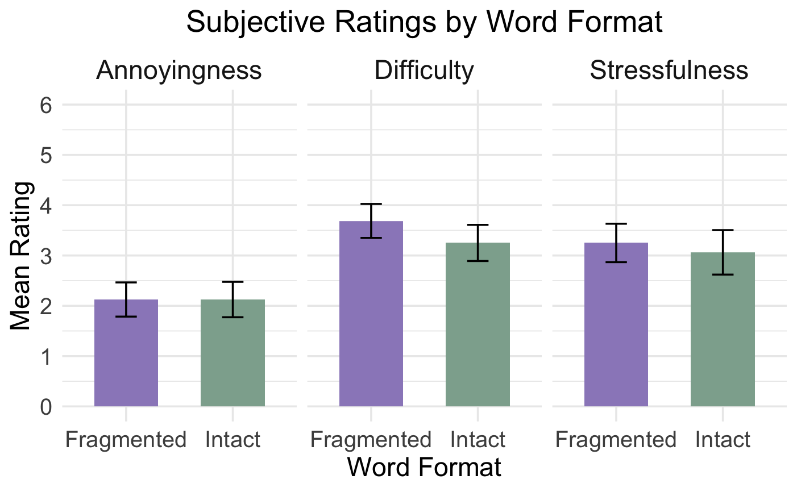

## Overview

This experimental study examined whether removing a vowel from words, or decreasing available orthographic cues, influences memory performance and subjective cognitive load ratings.

Based on the generation effect, actively filling in missing vowels may promote deeper processing and improve later recall. However, reconstructing incomplete words may also require greater mental effort, potentially increasing cognitive load and interfering with encoding.

## Research Question

**Does reconstructing words with missing vowels affect memory performance and perceived cognitive load compared with reading intact words?**

## Study Design

The study used a **within-subjects design** in which participants studied two memory lists:

- **Intact condition:** words were presented normally (e.g., *Kale, Tomato, Flour*)
- **Fragmented condition:** one vowel was removed from each word (e.g., *M_yonnaise, Blueb_rries, G_rlic*)

The independent variable was **vowel presence** (intact vs. fragmented).

The primary outcomes included:

- Correct recall
- False recall
- Perceived difficulty
- Stressfulness
- Annoyance

List category and presentation order were counterbalanced across four experimental forms.

## Experimental Procedure

Each participant completed the following sequence for both word-list conditions:

**1. Encoding → 2. Distractor Task → 3. Free Recall → 4. Post-Task Ratings**

During encoding, participants viewed 25 grocery or bedroom items presented sequentially for **2 seconds each**, with a **1-second interval** between words.

Participants then completed a **30-second arithmetic distractor task** followed by a free-recall test in which they entered as many words as they could remember.

Finally, participants rated the difficulty, stressfulness, and annoyance of the task using 6-point scales.

## Participants

Twenty-eight undergraduate students initially participated in the study.

Participants who reported being unable to identify fragmented words were excluded from the primary filtered analysis because they were unable to properly decode the stimuli, resulting in a final sample of **16 participants**.

## Results

### Memory Recall

Participants recalled more words in the intact condition (**M = 10.25, SD = 4.31**) than in the fragmented condition (**M = 8.06, SD = 4.11**) in the filtered sample.

The difference was not statistically significant, *t*(15) = 1.83, *p* = .087, *d* = 0.46.

{width=75%}

### False Recall

Participants produced more false recalls in the fragmented condition (**M = 0.94, SD = 2.24**) than in the intact condition (**M = 0.31, SD = 0.48**).

However, the difference was not statistically significant.

{width=75%}

### Subjective Cognitive Load

Fragmented word lists tended to be rated as **more difficult and stressful**, while annoyance ratings were approximately equal between conditions. These differences were not statistically significant.

## Interpretation

Overall, reconstructing words with missing vowels did not improve recall and may have made the task more cognitively demanding.

One possible explanation is that reconstructing fragmented words increased cognitive load and offset the benefits of the generation effect. Participants first had to decode a fragmented word before processing its meaning. This additional step may have consumed working-memory resources that otherwise could have been used to encode the word.

The higher level of false recall in the fragmented condition may also suggest greater reliance on semantic associations and category-based schemas when the presented words were more weakly encoded.

## Limitations

Several limitations should be considered:

- Words were displayed for a fixed amount of time, so participants may have spent much of the available time decoding fragmented words rather than encoding them.
- Word lists were not necessarily equivalent in their predictability within each semantic category.
- Excluding participants who could not identify fragmented words reduced the final sample to 16 participants and may have lowered statistical power.

## Future Research

Future studies could manipulate the amount of time participants have to study each word. Increasing exposure time may allow participants to reconstruct fragmented words while still having sufficient time to process their meaning.

Future research could also examine whether individual differences in working-memory capacity influence the ability to reconstruct fragmented words while simultaneously encoding them into memory.

## Skills Demonstrated

`Experimental Design` `Cognitive Psychology` `Memory Research` `Data Analysis` `Hypothesis Testing` `Research Methods` `Scientific Communication`